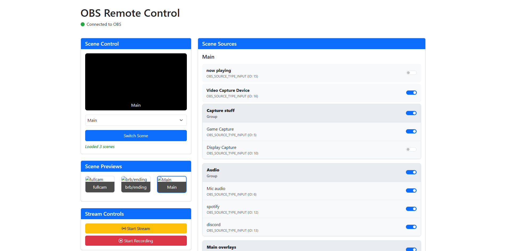

# OBS Dashboard WebSocket



A modern, responsive web dashboard for remotely controlling [OBS Studio](https://obsproject.com/) via its WebSocket API. Manage scenes, sources, audio, and streaming/recording—all from your browser.

---

## 🚀 Features

- **Scene Management**
  - View all scenes with live preview thumbnails
  - One-click scene switching
  - Visual indicator for the current scene

- **Source Control**
  - Toggle source visibility
  - Audio controls: mute/unmute, volume adjustment
  - Nested group support
  - Real-time updates

- **Streaming & Recording**
  - Start/stop streaming and recording
  - Status indicators

- **Connection Management**
  - Automatic reconnection
  - Connection health checks
  - Status monitoring

---

## 🛠️ Installation & Setup

### Prerequisites

- Node.js v14 or newer
- OBS Studio v28+
- OBS WebSocket plugin v5+ (usually bundled with OBS 28+)

### 1. Configure OBS WebSocket

- In OBS: `Tools` → `WebSocket Server Settings`
- Enable the server, set port (default: `4455`), and password

### 2. Clone & Install

```sh
git clone https://github.com/antiparty/obs-dashboard-websocket.git
cd obs-dashboard-websocket
npm install
cp .env.example .env
```

### 3. Configure Environment

Edit `.env`:

```ini
OBS_HOST=localhost
OBS_PORT=4455
OBS_PASSWORD=yourpassword
SERVER_PORT=2000
```

### 4. Start the Server

```sh
npm start
```

### 5. Open the Dashboard

Visit [http://localhost:2000](http://localhost:2000) in your browser.

---

## 🖥️ Usage

- **Main Dashboard:** Control scenes, sources, and audio from the main page.
- **Studio Panel:** Advanced controls and layout editing via the "Open Studio Panel" button.

---

## 📚 API Reference

| Endpoint                       | Method | Description                  | Example Payload                                 |
| ------------------------------ | ------ | ---------------------------- | ------------------------------------------------|
| `/api/obs-status`              | GET    | Get OBS connection/status    | —                                               |
| `/api/scenes`                  | GET    | List all scenes              | —                                               |
| `/api/sources/:sceneName`      | GET    | Get sources for a scene      | —                                               |
| `/api/switch_scene`            | POST   | Switch to a scene            | `{ "sceneName": "Main" }`                       |
| `/api/toggle_source`           | POST   | Toggle source visibility     | `{ "sceneName": "Main", "sourceId": 1, "visible": true }` |
| `/api/toggle_mute`             | POST   | Mute/unmute audio source     | `{ "sourceName": "Mic/Aux", "muted": true }`    |
| `/api/set_volume`              | POST   | Set audio source volume      | `{ "sourceName": "Mic/Aux", "volume": 0.8 }`    |
| `/api/streaming`               | POST   | Start/stop streaming         | `{ "action": "start" }` or `{ "action": "stop" }`|
| `/api/recording`               | POST   | Start/stop recording         | `{ "action": "start" }` or `{ "action": "stop" }`|
| `/api/add_source`              | POST   | Add a new source to a scene  | `{ "sceneName": "Main", "sourceName": "Browser", "inputKind": "browser_source", "inputSettings": { ... } }` |
| `/api/delete_source`           | POST   | Delete a source from a scene | `{ "sceneName": "Main", "sourceId": 5 }`        |
| `/api/set_position`            | POST   | Set position of a scene item | `{ "sceneName": "Main", "sceneItemId": 5, "x": 100, "y": 200 }` |
| `/api/scene-previews`          | GET    | Get preview images for scenes| —                                               |
| `/api/audio-levels`            | GET    | Get real-time audio levels   | —                                               |
| `/api/verify-connection`       | GET    | Check OBS connection         | —                                               |

---

## 📝 License

MIT License © 2025 Asuritys-Inc

---

## 🤝 Contributing

Pull requests and issues are welcome! Please open an issue to discuss your ideas or report bugs.

---

## 💬 Support

For questions or help, open an issue on [GitHub](https://github.com/antiparty/obs-dashboard-websocket/issues).